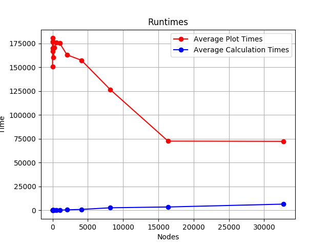
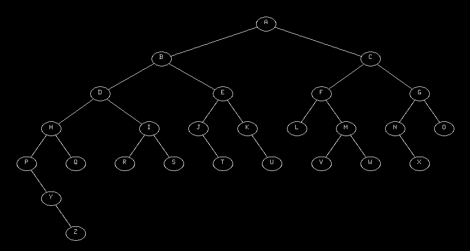

# Installation & Execution

1. Navigate to the directory with the source and run `make` to build the code. 
2. The code can be run using the command `./a.out`. One command line argument is expected by the program. For interactive mode (where you are asked to enter points manually one by one) type 'i' and for inputting the binary tree as an array, use 'a'. Details on how the input format works will be explained in a subseuent subsection.

## Array: Input Format
1. The 0th element of the array is the root. 
2. The left and right children of element *i* in the array are *2i + 1* and *2i + 2* respectively. 
3. The first line of input must contain an integer *n*, the size of the array being inputted. 
4. The next line must contain *n* space-separated characters denoting the value inside of the nodes. 
5. If a node isn't present, use `-` to indicate that element doesn't exist. 

# Examples
## Perfect Binary Trees Dataset

You can run the program to make complete binary trees of a certain depth. 
1. Go to the `examples` directory and run `python generate_perfect_trees.py`.
2. Come back to the source director. `cd ..`
3. Run `grep "^15 " examples/perfect_binary_trees |  ./a.out a` to select a binary tree with `15 ` nodes.
4. The value 15 can be modified to `[1, 3, 7, 15, 31, 63, 127, 255, 511, 1023, 4095...]`.
5. The program will report the time taken to calculate the coordinates and the time taken to plot them separatly.

## Other Examples
More (small) examples are available in the `examples/examples.txt` file. Each line is one example. To run the 5th example, use: `head examples/examples.txt -n 5 | tail --lines=1 | ./a.out a` or just run `./a.out a` and copy-paste the line.

# Run Times
Running it on perfect and complete trees of different sizes gave us this graph, which shows that calculation time increases significantly as input size increases while plotting time doesn't seem to be as straightforward. The fall in plot times at large # of nodes can probably be attributed to the fact that the number of points in the circle of each node falls as the node size becomes smaller. These results can be reproduced by: 

1. Edit the `main.cpp` and other files so that their only output on the console is two comma-separated values - in the format `calculate_time, plot_time`.
2. Run `python runtimes.py`, which plots binary trees of sizes `1, 3, 7, ...` many times and plots the average time taken for plotting and calculation for each size of input. 
3. `runtimes.py` generates two files `all_plot_times.csv` and `all_calculate_times.csv`, that store information of all the runs in a CSV format. These files are saved in the `examples/` directory of this repository. 
4. The plot was made on a system with these configurations: `Intel® Core™ i5-5200U CPU @ 2.20GHz × 4, GeForce 920M/PCIe/SSE2, 64-bit running Ubuntu 18.04 LTS`. 
 


# Documentation

Apart from this README, additional documentation has been provided in the form of HTML files and detailed comments in code that explain what each function and class do. HTML documentation has been generated using Doxygen, and the configuration file for the same can be seen in `.doxygen-config`. You can create the HTML files using the command `doxygen .doxygen-config` on any system that has doxygen installed. 

# General Discussion

The code is mostly a line-to-line reimplementation of the Pascal code given in the paper. The first version of the program couldn't really handle large binary trees - the node radius was set to a constant value of 20 pixels, and only trees upto a depth of 4/5 levels could be drawn. Also, the first version didn't have labelling for the nodes nor did it have the ability to effectively take input from file - it supported only interactive input. The next versions of the code improved on this baseline by: 

* scaling down the entire tree by a constant factor as input gets bigger and bigger. As a result, the program can display trees of depth 7-10 as well, though the nodes and lines get increasingly smaller - this is a limitation with the screen size that we can't really handle. 
* array mode of input, which was explained above, was added
* labels are now displayed inside each node - also, labels can now be characters, as opposed to integer-only support in the first version of the code. Labels will be displayed only for small graphs though. 

One bug that took us some time to fix was an erronous setter that looked something like this, that ensured that the value of an attribute would never be edited: 

```
Node::setX(int x){
	x = x;
}
```

Surprisingly, despite this bug, the code worked perfectly fine for a decent number of small inputs, making it harder to isolate this bug. Once we discovered this, we decided to discard all the getters and setters instead. A sample tree output is shown below.

